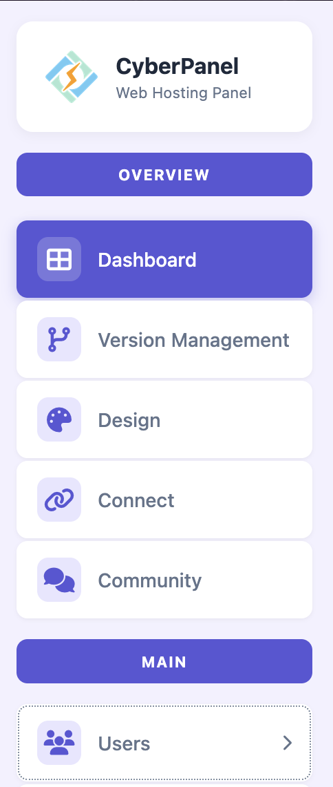
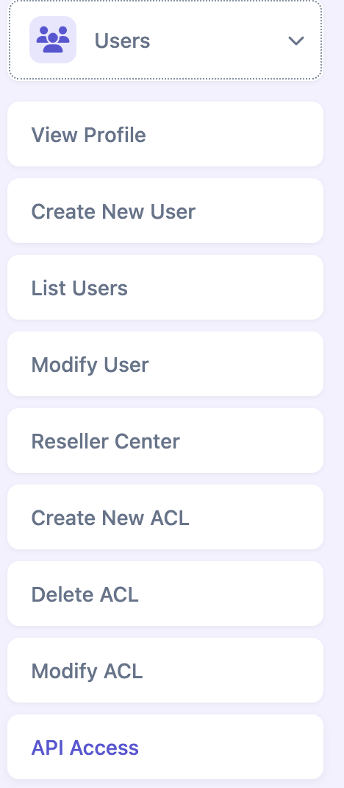
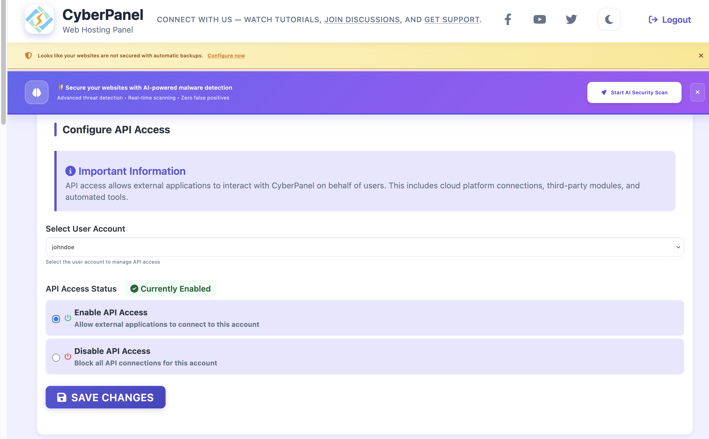

# CyberPanel

Documentation & Setup guide for the CyberPanel provider.

## Functions

CyberPanel identifies hosting accounts by their domain name, so functions marked below need the account's domain as well as its username.

| Function | Supported | Notes |
|---|---|---|
| create() | Yes | A username and password are generated if not provided. The package must exist (see [Packages](#packages)) |
| getInfo() | Partially | Only confirms the account exists. The API does not report the package or suspension state, so defaults are returned |
| getUsage() | No | The API does not report per-account resource usage |
| getLoginUrl() | Partially | CyberPanel has no single sign-on, so this returns the panel URL with the account's credentials for a manual login. If no current password is provided, the account's password is changed to a random one first |
| changePassword() | Yes | |
| changePackage() | Yes | Requires the domain. The package must exist (see [Packages](#packages)) |
| changePrimaryDomain() | No | |
| suspend() | Yes | Requires the domain |
| unSuspend() | Yes | Requires the domain |
| terminate() | Yes | Requires the domain |
| grantReseller() | No | The API does not manage reseller privileges |
| revokeReseller() | No | The API does not manage reseller privileges |

## Configuration

| Field | Description |
|---|---|
| Hostname | Hostname of the CyberPanel server, e.g. `cp.example.com` |
| Port | Port the panel listens on. CyberPanel uses `8090` by default. If left empty, requests go to `https://<hostname>/` with no port |
| Username | Username of the CyberPanel admin account used for API requests |
| Password | Password of that admin account |
| SSL Verify | Whether to verify the server's SSL certificate (default: off) |

## Enabling API access

CyberPanel rejects API requests unless API access is enabled for the account whose credentials you configure above.

1. Log in to CyberPanel as an admin and open **Users** in the **Main** section of the sidebar.

   

2. In the **Users** menu, click **API Access**.

   

3. Under **Select User Account**, choose the account to use for the API, select **Enable API Access**, and click **Save Changes**. The **API Access Status** should then show **Currently Enabled**.

   

## Packages

Every hosting account in CyberPanel is created with a package, which sets its resource limits. Create your packages in CyberPanel before provisioning accounts. See [CyberPanel Package Management](https://cyberpanel.net/KnowledgeBase/home/cyberpanel-package-management/) for how to create one.

When you create an account or change its package, the package name given to the provider must match a package name in CyberPanel **exactly**, including upper and lower case. The provider checks the name against CyberPanel's package list first, and fails with `The requested package does not exist on the server` if there is no match.
